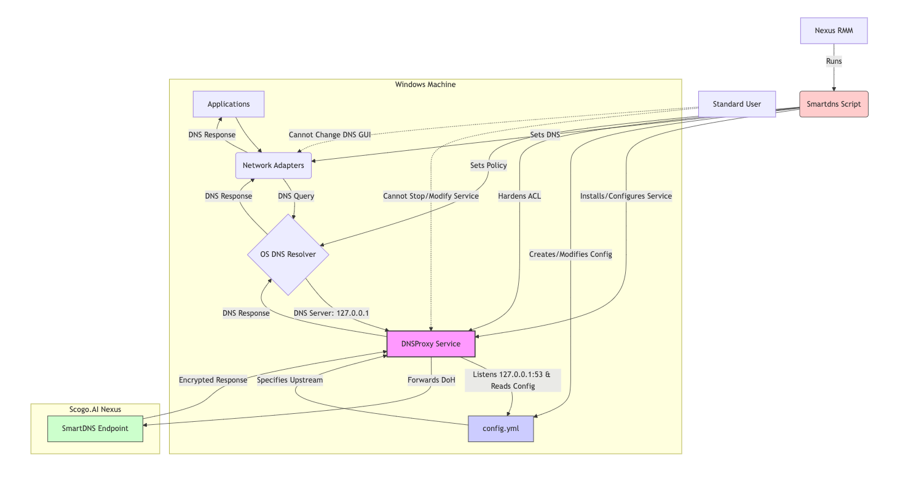

# NextDNS via Cloudflared Deployment Script

This PowerShell script (`nextdns.ps1`) automates the setup of NextDNS on a Windows machine using `cloudflared` as a secure DNS-over-HTTPS (DoH) proxy.

## What it Does:

1.  **Downloads & Installs `cloudflared`**: Fetches the latest `cloudflared.exe` and places it in `C:\Program Files\cloudflared`.
2.  **Configures `cloudflared`**: Creates a configuration file (`config.yml`) in `C:\Windows\System32\config\systemprofile\.cloudflared` to:
    *   Enable the DNS proxy.
    *   Listen on `127.0.0.1:53`.
    *   Forward DNS queries to the specified NextDNS DoH endpoint (`https://dns.nextdns.io/d6849a`).
3.  **Installs as a Service**: Sets up `cloudflared` to run as a Windows service (`Cloudflared`) under the `LocalSystem` account, ensuring it starts automatically.
4.  **Hardens Security**:
    *   Adjusts the service's permissions so standard users cannot stop or modify it.
    *   Sets a registry policy to disable the DNS settings in the network adapter properties for non-administrators.
5.  **Redirects System DNS**: Configures all active network adapters to use `127.0.0.1` (the local `cloudflared` instance) as their DNS server.
6.  **Verifies Setup**: Checks if the service is running, listening on port 53, and performs DNS resolution tests.
7.  **Logging**: Creates detailed installation and verbose logs in `C:\Windows\System32\config\systemprofile\.cloudflared\logs`.

**Outcome:** All DNS requests from the machine are securely routed through the local `cloudflared` service to NextDNS via DoH. The configuration is locked down to prevent easy modification by standard users.

**Requirement:** The script must be run with Administrator privileges.

---

## Successful Deployment Logs Example:
```
Initializing log directory...
[INFO] Checking for services that might interfere with port 53...
[INFO] DNS Client service is running. Checking if it's using port 53...
[INFO] Creating installation directory...
[INFO] Downloading cloudflared...
[INFO] Creating service configuration directory...
[INFO] Creating configuration file...
[SUCCESS] Configuration file created in systemprofile location
[INFO] Installing cloudflared service...
[INFO] Service already exists. Stopping and removing...
[INFO] Uninstalling existing service...
[INFO] Installing cloudflared service...
[INFO] Starting cloudflared service with PowerShell commands...
[SUCCESS] Service started successfully
[INFO] Checking if cloudflared is properly binding to port 53...
[SUCCESS] Detected service running on port 53:   TCP    127.0.0.1:53           0.0.0.0:0              LISTENING       3756   UDP    127.0.0.1:53           *:*                                    3756
[INFO] Hardening service ACLs...
[INFO] Configuring network adapters to use localhost as DNS server...
[INFO]   Setting DNS for adapter: Ethernet
[INFO] Setting registry policy to lock DNS settings...
[INFO] Verifying installation...
Service status from sc.exe:
 SERVICE_NAME: Cloudflared          TYPE               : 10  WIN32_OWN_PROCESS           STATE              : 4  RUNNING                                  (STOPPABLE, NOT_PAUSABLE, ACCEPTS_SHUTDOWN)         WIN32_EXIT_CODE    : 0  (0x0)         SERVICE_EXIT_CODE  : 0  (0x0)         CHECKPOINT         : 0x0         WAIT_HINT          : 0x0
[SUCCESS] Service status: Running
[INFO] Flushing DNS cache before testing...
[INFO] Waiting for DNS service to fully initialize...
Port 53 status: In use by process
  TCP    127.0.0.1:53           0.0.0.0:0              LISTENING       3756   UDP    127.0.0.1:53           *:*                                    3756
[INFO] Testing DNS resolution with timeout...
[SUCCESS] DNS resolution successful: 2600:1406:bc00:53::b81e:94ce
[SUCCESS] NextDNS resolution successful: 2606:4700:20::681a:aba
[SUCCESS] Installation completed!

NextDNS is now configured with cloudflared using DoH. All DNS queries will be encrypted and sent to NextDNS.
To verify this is working correctly, visit https://test.nextdns.io
```
Important configuration notes:
The cloudflared service uses the configuration file at: C:\Windows\System32\config\systemprofile\.cloudflared\config.yml
Detailed logs have been saved to:
  - Install log: C:\Windows\System32\config\systemprofile\.cloudflared\logs\cloudflared_install.log
  - Verbose log: C:\Windows\System32\config\systemprofile\.cloudflared\logs\cloudflared_verbose.log
  - Diagnostic logs: C:\Windows\System32\config\systemprofile\.cloudflared\logs

If you're experiencing issues with DNS resolution, try these troubleshooting steps:
1. Restart your computer
2. Manually check if cloudflared service is running after restart
3. Ensure no other services are using port 53
4. Check firewall settings to allow cloudflared to communicate
5. Review the logs in C:\Windows\System32\config\systemprofile\.cloudflared\logs for detailed information

## Architecture Diagram

